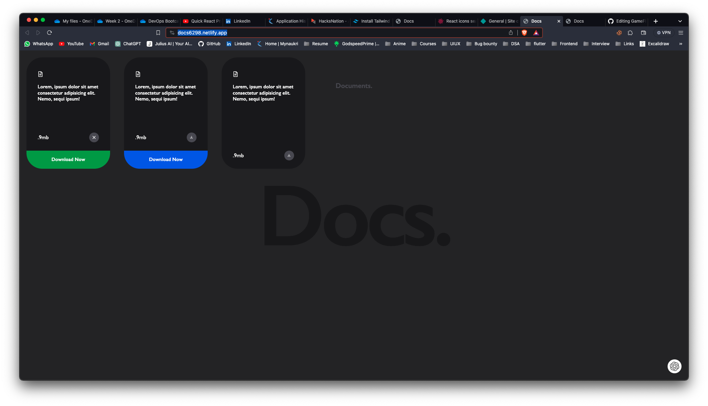
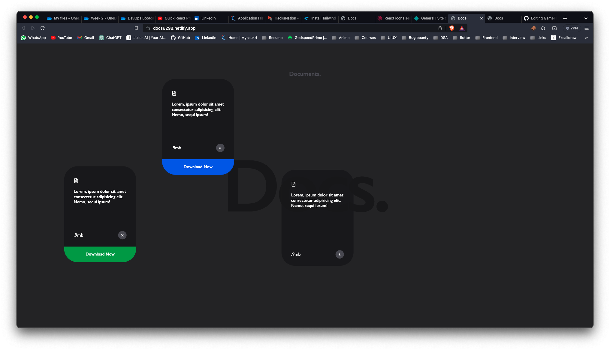

# Docs

### Implemented Docs clone

**Link to project:** [https://docs6298.netlify.app/]

## How It's Made:

**Tech used:** React, Tailwind, Framer Motion , React icons

- Build front-end with React 
- Build reusable function components
- Styled components using Tailwind CSS
- Used React Framer Motion to make components Dragable
